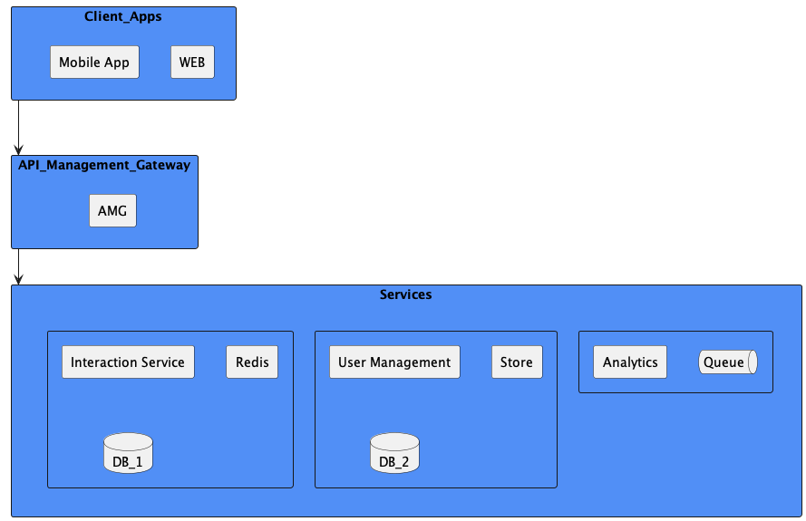

Welcome to the Github repository for O'Reilly Architectural Kata 2022 where we (Team Mustang) proposed our solution for the Hey Blue! platform.

# Team Mustang
* Dan Ambrošić
* Domagoj Božić
* Tomislav Kralj
* Tomislav Novak

# Hey Blue! Platform

https://heyblue.app/

## Requirements

[Hey Blue App requirements](https://docs.google.com/document/d/10o-4eEzFo005pqDt_ORCztzaQCQ_9FNWYrxFasou3Eo/edit)

## Proposed solution

### Context diagram

### Logical diagram

### User stories

[User stories](./user-stories/User_stories.md)

### ADRs

1. [Use service based architecture](./ADRs/ADR-001.md)
2. [Use redis for storing temporary locations](./ADRs/ADR-002.md)
3. [Calculate distance on user devices](./ADRs/ADR-003.md)
4. [Use 3rd party affiliate networks](./ADRs/ADR-004.md)
