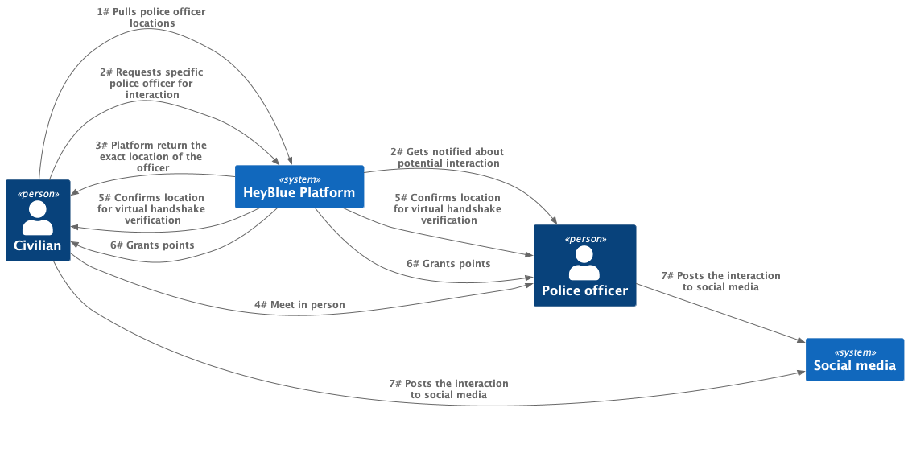

## User stories

### Police officer registration

### Police officer user story
When a police officer wishes to interact they will share their location over the Hey, Blue! mobile application.
Hey, Blue! the mobile app pushes police officers' location to the platform every few seconds and the platform records the latest location.
Officer will get a notification when a civilian is requesting an interaction which can finalize in a virtual handshake or by the officer sharing a QR code with the civilian.
After the platform has confirmed successful interaction it will grant points to the officer.
Interaction details can be posted on social media.

### Civilian user story
When civilian wishes to use Hey, Blue! app, it will pull all available police officers' locations within the chosen radius.
The Hey, Blue! mobile app will show police officer's locations and the app will send notifications, if they are turned on, when a new police officer enters the civilian's chosen perimeter.
As the civilian decides with which officer to interact the app will send the exact location of the officer.
After the successful interaction with the officer, via virtual handshake or scanning of a QR code, civilians will be granted points by the platform.
The app will produce a reward in a form of a congratulatory message. The details of the interaction can be posted to civilians' social media.

### Civilian user story - redeem points
When the civilian wishes to redeem their points for goods, they can visit storefronts of the participating businesses on the Hey Blue platform. When they
choose where they want to spent their points, they will receive an affiliate link which will lead them to the store of the chosen business with an applied
discount.

### Interaction between a civilian and a police officer

### Business user story
Businesses that wish to offer goods which can be redeemed for points, must be registered with an affiliate network through which the purchases will
be conducted. When registering a business on the Hey Blue! platform, the business must provide an identification on the affiliate network. Along with
that they can upload a catalog in a static format which can contain offered goods (e.g. pictures and descriptions) and other marketing material. That catalog
will be shown to users when visiting the storefront of a business.

Businesses can also manage the locations of their physical stores on the Hey Blue platform and civilians will receive notification when they are
nearby one of the participating stores (if they have notifications enabled).

### Charity user story
Charities can upload their storefronts to the Hey Blue platform in the same way that businesses do in a static format. They can contain various materials
that will describe to the participating police officers what they do and incentivize them to donate points.

Charities can redeem donated points for goods in the same way that civilians can.
